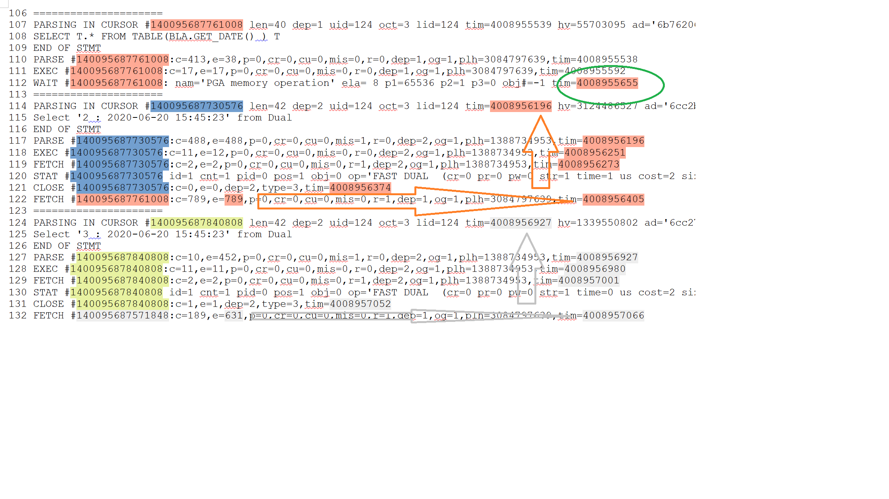

# dependent cursors

a small collection of test scripts to show cursors with dep=x in SQL*Trace. 

*  test_dept_prep.sql 
	setup user trc and package bla
	
*  test_dept_t1.sql and test_dept_t2.sql 
    small tests, t1 with same cursors on dep=1
     t2 with diferentcursors on del=1 to distinguis them 

* [reports](reports/) directory 
    some tracefiles (for test1 and test2) - and their reports (created with [Method-R Workbench](https://method-r.com/software/workbench/) )	 

*An explanation for the image below:*

Let's start with cursor 140095687730576 in line 114. \
It is **dep=2** - but where does it belong to? \
This cursor executes and closes until line 121. \
In line 122 we see a FETCH of cursor 140095687761008. \
It appears at tim=4008956405 with e=789. \
Which means, it covers all activities between tim=4008955616 and 4008956405. \
Going back in time (the orange arrow upwards) you can see all rows with tim= within this range. \
The whole Cursor 140095687730576 falls into this periode, which makes it easy to make the ancestors relation. \

In line 112 you can see one of those timing glitches which makes manual analysis so hard, and Method-R Workbench & tools so valuable: \
The fetch of line 122 goes back until "sometime" in line 112. \
The profile tries to iron this out with unaccounted-for ... which makes our life much easier. \
You can see a similar pattern in the 2nd part of the picture, all highlighted in yellow and grey. \

